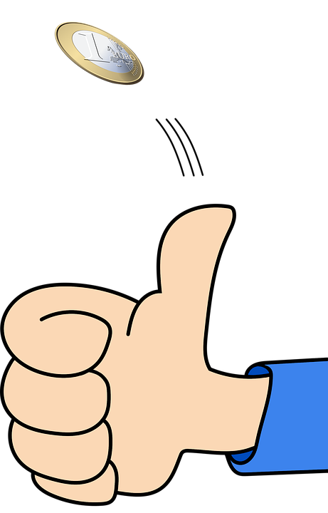
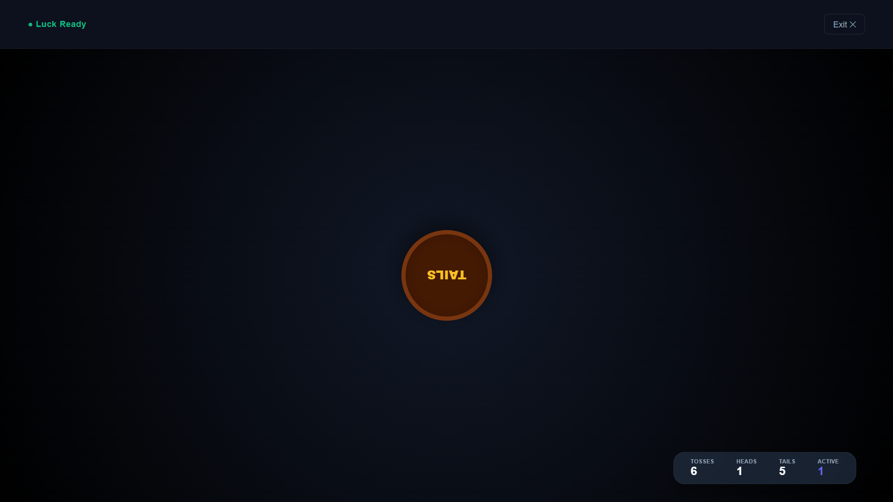
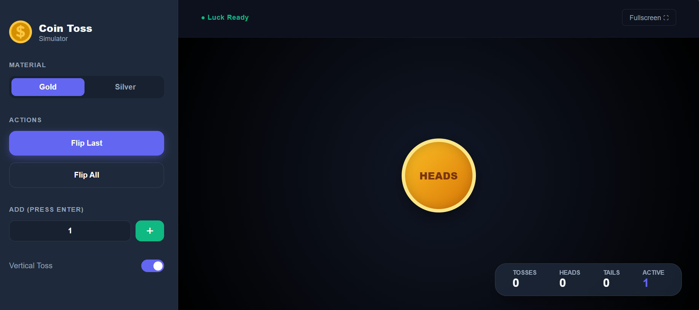
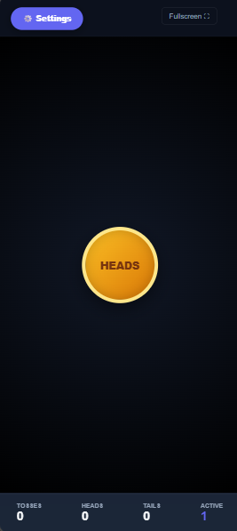
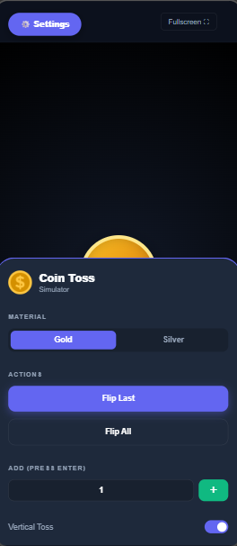

#  Coin Toss Simulator

Welcome to the **Coin Toss Simulator**! This interactive web application allows you to simulate flipping coins with realistic animations and sound effects. Whether you're making decisions, teaching probability, or just having fun, this tool is perfect for you.

**Live Demo**: [https://easyflipping.netlify.app](https://easyflipping.netlify.app)

---

## Preview

 

 

## Features

- **Realistic Coin Toss**: Simulate flipping a coin with smooth animations.
- **Multiple Coins**: Add and toss multiple coins at once.
- **Toss Styles**:
  - **In-Place Toss**: The coin spins in place.
  - **Vertical Toss**: The coin flips into the air and lands.
- **Full-Screen Mode**: Focus on the coins with a full-screen view.
- **Sound Effects**: Enjoy immersive sound effects for flipping and landing.
- **Statistics**:
  - Track the number of heads and tails.
  - View the total number of coins and tosses.
- **Responsive Design**: Works seamlessly on desktop, tablet, and mobile devices.

---

## Technologies Used

- **Frontend**:
  - HTML5
  - CSS3 (with animations and flexbox)
  - JavaScript (for interactivity and logic)
- **Hosting**: Netlify

---

## How to Use

1. **Toss a Single Coin**:

   - Click the **Flip** button or Touch the coin to flip a single coin.

2. **Add Multiple Coins**:

   - Enter the number of coins in the input field and click **+** or just click **+** to add one coin.

3. **Toss All Coins**:

   - Click the **Flip All Coins** button to flip all coins at once.

4. **Switch Toss Style**:

   - Use the toggle switch to choose between **In-Place Toss** and **Vertical Toss**.

5. **Full-Screen Mode**:

   - Click the **⛶** icon to enter full-screen mode.
   - Click the **✖** icon to exit full-screen mode.

6. **View Statistics**:
   - Check the stats at the bottom of the screen for:
     - Total Coins
     - Total Tosses
     - Heads Count
     - Tails Count

---

## Design Highlights

- **Dynamic Background**: A gradient background that changes color over time.
- **Realistic Coin Design**: 3D-style coins with heads and tails.
- **Immersive Sound Effects**: Sound effects for flipping and landing.
- **Responsive Layout**: Optimized for all screen sizes.

---

## Deployment

This project is hosted on **Netlify**. To deploy your own version:

1. Fork this repository.
2. Connect your GitHub account to Netlify.
3. Deploy the repository to Netlify.
4. Your site will be live at `https://your-site-name.netlify.app`.

---

## 📂 Project Structure

coin-toss-simulator/  
├── index.html # Main HTML file  
├── styles.css # CSS for styling and animations  
├── script.js # JavaScript for interactivity  
├── Sounds/ # Sound effects for the coin toss  
│ ├── coin-flip-shimmer.mp3  
│ └── coin-spinning.mp3  
├── images/ # Coin images  
│ ├── coin.png  
│ └── coin-flipping.png  
└── README.md # Project documentation

---

## 🤝 Contributing

Contributions are welcome! If you'd like to improve this project, follow these steps:

1. Fork the repository.
2. Create a new branch (`git checkout -b feature/YourFeature`).
3. Commit your changes (`git commit -m 'Add some feature'`).
4. Push to the branch (`git push origin feature/YourFeature`).
5. Open a pull request.

---

## 📄 License

Feel Free to use it . I Arun Neupane hereby allow free use of this project.

---

## Credits

- **Developer**: Arun Neupane
- **Inspiration**: Built for fun and learning!

---

## Contact Me

Hello! 👋  
I’m **Arun Neupane** from **Nepal 🇳🇵**.  
Open to collaboration, coding discussions, projects, or just a friendly hello.

---

### Connect with Me

---

**Location:** Nepal  
_Let’s build something awesome together!_

Enjoy flipping coins! 🎉
